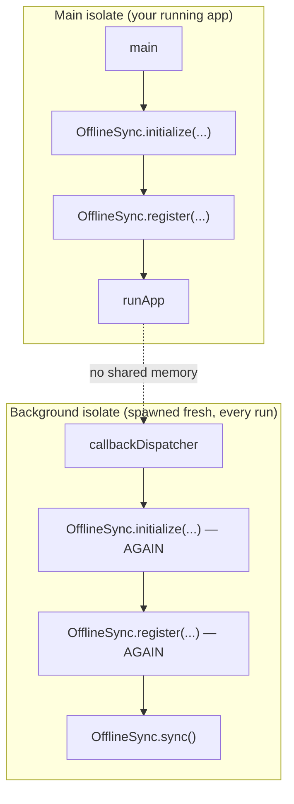

# Background Sync

Everything so far — [local storage](./local-storage.mdx),
[network sync](./network-sync.mdx),
[retry & backoff](./retry-and-backoff.mdx),
[conflict resolution](./conflict-resolution.mdx), and
[connectivity detection](./connectivity-detection.mdx) — runs while the
app is open. `offline_sync_workmanager` extends the same queue-draining
behavior to when the app is **closed**, using
[`workmanager`](https://pub.dev/packages/workmanager) under the hood.

```dart
await BackgroundSync.initialize(callbackDispatcher: callbackDispatcher);
```

From here on, the queue is drained periodically even if the user closes
the app entirely.

## The one thing you must understand before using this

`callbackDispatcher` runs in a **completely separate isolate** from your
running app. It shares no memory with it — none of `OfflineSync`'s
in-app state (its storage connection, registered adapters, transport)
exists there. This isn't an implementation detail; it's the central fact
that shapes this whole package's API.



Concretely: `offline_sync_workmanager` cannot rebuild your app's
`OfflineSync` setup for you — it doesn't know your adapters, your
endpoints, or your auth. Your `callbackDispatcher` has to repeat the
relevant parts of your `main()` from scratch, every single time it
fires.

## Full setup

```dart
import 'package:dio/dio.dart';
import 'package:offline_sync_core/offline_sync_core.dart';
import 'package:offline_sync_dio/offline_sync_dio.dart';
import 'package:offline_sync_drift/offline_sync_drift.dart';
import 'package:offline_sync_workmanager/offline_sync_workmanager.dart';

/// Must be top-level (or static) and annotated exactly like this — see
/// "@pragma('vm:entry-point') is not optional" below.
@pragma('vm:entry-point')
void callbackDispatcher() {
  runBackgroundSyncTask(() async {
    final dio = Dio(BaseOptions(baseUrl: 'https://api.example.com'));
    await OfflineSync.initialize(
      storage: DriftLocalStorage(), // same on-disk file the app itself uses
      transport: DioSyncTransport(dio),
      autoSync: false, // no widget tree here to trigger anything from
    );
    OfflineSync.register<User>(userAdapter);
    await OfflineSync.sync();
  });
}

Future<void> main() async {
  WidgetsFlutterBinding.ensureInitialized();

  await OfflineSync.initialize(/* your normal app setup */);
  OfflineSync.register<User>(userAdapter);

  await BackgroundSync.initialize(callbackDispatcher: callbackDispatcher);

  runApp(const MyApp());
}
```

`DriftLocalStorage()`'s default constructor resolves to the same on-disk
sqlite file every time it's constructed, so as long as both isolates
construct it the same way, they're reading and writing the same
database — no extra wiring needed there.

## API reference

### `BackgroundSync.initialize({ callbackDispatcher, frequency, constraints })`

Call once from `main()`, before `runApp()`. Registers a **periodic**
background task.

| Param | Default | Notes |
|---|---|---|
| `callbackDispatcher` | — | Your top-level entry point. Required. |
| `frequency` | 15 minutes | A *minimum*, not a promise — see [Gotchas](#gotchas). |
| `constraints` | `NetworkType.connected` | Passed straight through to `WorkManager`. |

### `BackgroundSync.cancel()`

Stops the periodic task.

### `BackgroundSync.scheduleOneOffTest({ constraints })`

Schedules a **one-off** task that runs as soon as its constraints are
met — no waiting on any interval. For development only: gives you a
fast, deterministic signal instead of waiting up to 15+ minutes.

```dart
ElevatedButton(
  onPressed: () => BackgroundSync.scheduleOneOffTest(),
  child: const Text('Schedule background test'),
)
```

:::caution Must be scheduled while actually offline
Calling this from `main()` — or from any UI action while the device is
already online — fires it almost immediately, which proves nothing
about "syncs after reconnecting." Trigger it deliberately, with airplane
mode already on.
:::

### `BackgroundSync.recentAttempts()`

Returns the last 20 recorded attempts (newest last) — see
[Diagnostics](#built-in-diagnostics).

### `runBackgroundSyncTask(Future<void> Function() performSync)`

Call from inside `callbackDispatcher`. Wraps `Workmanager().executeTask`,
routes to your `performSync`, and records the outcome automatically.

## Built-in diagnostics

A background isolate's log output doesn't reliably show up in
`adb logcat`. So every attempt is recorded for you automatically —
persisted via `shared_preferences`, which is the one thing that actually
survives the isolate exiting between runs:

```dart
final attempts = await BackgroundSync.recentAttempts();
for (final a in attempts) {
  print(a); // "2026-07-18 13:32:51.202728 — success"
}
```

| Field | Meaning |
|---|---|
| `startedAt` | When the attempt began. |
| `outcome` | `'success'`, `'failure'`, or `'timeout'`. |
| `detail` | Error message, or elapsed time before timing out. `null` on success. |

A simple debug screen:

```dart
Future<void> _showBackgroundSyncLog(BuildContext context) async {
  final attempts = await BackgroundSync.recentAttempts();
  showDialog(
    context: context,
    builder: (_) => AlertDialog(
      title: const Text('Background sync log'),
      content: SingleChildScrollView(
        child: Text(
          attempts.isEmpty
              ? 'Never run yet'
              : attempts.reversed.map((a) => a.toString()).join('\n\n'),
        ),
      ),
    ),
  );
}
```

### Timeout protection

`performSync` is wrapped in a 2-minute timeout by default
(`kBackgroundSyncTimeout`). A hung request — no timeout of its own,
stuck against a dead connection — reports as `'timeout'` and tells
WorkManager to retry, instead of leaving the job (and you) waiting
indefinitely with no signal.

:::danger "Success" means "didn't throw" — not "everything sent"
`OfflineSync.sync()` deliberately swallows per-operation errors so one
bad operation can't take down the rest of the queue (see
[Retry & Backoff](./retry-and-backoff.mdx)). A background run can log
`'success'` here while every individual send inside it actually failed —
`sync()` itself still completed without throwing.

A `'success'` entry tells you the background task *ran*. It does not by
itself tell you the queue is empty. Check
`OfflineSync.pendingOperationsCount()` if you need to confirm the queue
actually drained.
:::

## Testing

The routing/timeout/logging logic — `handleBackgroundTask` — is a pure
function, unit-testable without the real `workmanager` plugin or a
platform channel:

```dart
test('reports failure if performSync throws', () async {
  final result = await handleBackgroundTask(
    kOfflineSyncTaskName,
    () async => throw Exception('network unreachable'),
  );

  expect(result, isFalse);
});
```

`BackgroundSync.initialize()` / `.cancel()` / `.scheduleOneOffTest()`
talk to the real plugin through a platform channel and **cannot** run in
a plain `flutter_test` unit test — validate those manually, on-device
(next section).

## Gotchas

These cost real debugging time to work out.

### `flutter run` kills background work

Whether in debug or `--release`, as long as the tooling is still
attached to the device (a `flutter run` session), stopping it cancels
any in-flight `WorkManager` task immediately. A task that "gets
cancelled the instant I stop the app" is not a bug — it's the debugger
tearing down the isolate.

**To validate for real:**

```bash
flutter build apk --release
adb install build/app/outputs/flutter-apk/app-release.apk
```

Then launch the app from the device's app drawer — not from any
terminal — with no debugger attached at all.

### `frequency` is a floor, not a promise

Android enforces a 15-minute minimum and batches actual execution
around battery/Doze state. "Reconnected but nothing happened for 10
minutes" is expected, not broken. Use `scheduleOneOffTest()` during
development instead of waiting on the periodic schedule.

### `@pragma('vm:entry-point')` is not optional

Omit it and everything works in debug builds, then silently does
nothing in release — the compiler tree-shakes the function away since
nothing in the visible call graph references it. This is the single
most common cause of "works on my machine, does nothing for users."

### iOS is fundamentally less reliable here

`BGTaskScheduler` underneath doesn't guarantee timing, or even that the
task runs at all — the OS decides based on battery and recent app
usage. Don't design a feature that depends on background sync happening
on any particular schedule on iOS specifically.

## Next steps

- [Architecture: Background sync as a re-initialization boundary](./architecture.mdx#10-background-sync-a-full-re-initialization-boundary-not-shared-state) —
  the full reasoning behind this design, plus a longer "lessons learned"
  log from validating it.