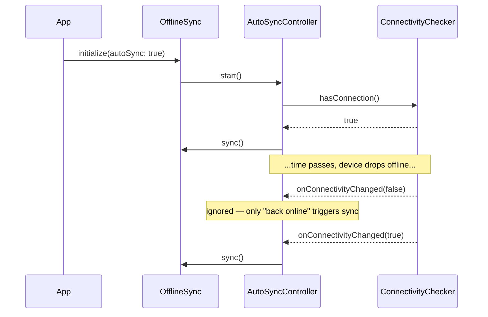

# Connectivity Detection

By default, `OfflineSync` watches the device's connectivity and calls
[`sync()`](./network-sync.mdx) automatically the moment a connection comes
back — you never have to wire up a "retry when online" button yourself.

```dart
await OfflineSync.initialize(
  storage: DriftLocalStorage(),
  transport: DioSyncTransport(dio),
  // autoSync: true is the default — shown here only for clarity.
  autoSync: true,
);
```

That's it. From here on, whenever the device goes offline and comes back,
any operations queued by [`save()`](./local-storage.mdx#save) or
[`delete()`](./local-storage.mdx#delete) while offline are sent
automatically.

## How it works

`OfflineSync` doesn't poll for connectivity — it subscribes to a stream.
Internally, this is handled by a small collaborator called
`AutoSyncController`, which does two things:

1. **On startup**, it checks whether the device is *already* online. If
   so, it kicks off an immediate `sync()` — this matters because a
   connectivity *change* event will never fire for a state that hasn't
   changed since the app launched. Without this check, a user who opens
   the app already connected to wifi would have to wait for some
   unrelated connectivity blip before their queued operations ever sent.
2. **It subscribes** to connectivity change events for the rest of the
   app's lifetime. Every time the device transitions from offline to
   online, it calls `sync()`.



`sync()` itself is safe to call this way because it's
[de-duplicated](./network-sync.mdx#concurrent-calls): if a manual sync
triggered by the user happens to overlap with an automatic one, the
second call simply awaits the first instead of running a second pass
over the same queue.

## Under the hood: `connectivity_plus`

The default implementation, `ConnectivityPlusChecker`, is a thin wrapper
around the [`connectivity_plus`](https://pub.dev/packages/connectivity_plus)
package. It's worth understanding exactly what "connected" means here:

:::info What "connected" actually checks
`ConnectivityPlusChecker` reports whether the OS says there's an active
network interface — wifi, mobile data, ethernet, etc. It does **not**
verify that interface has *working* internet access. A device joined to
a wifi network with no real internet still reports "connected".

This is intentional, not a limitation to work around. This checker's only
job is "is it worth attempting a sync right now" — if the network turns
out to be a dead end, `sync()` will simply fail against the real server,
and [retry/backoff](./retry-and-backoff.mdx) takes over from there.
Trying to verify *actual* internet reachability here would add latency
and false negatives (some networks block the kind of reachability probes
this would require) for very little practical benefit.
:::

## Writing your own `ConnectivityChecker`

`OfflineSync` never talks to `connectivity_plus` directly — it depends
only on an interface:

```dart
abstract class ConnectivityChecker {
  Future<bool> hasConnection();
  Stream<bool> get onConnectivityChanged;
}
```

This is the same adapter pattern used for
[`LocalStorage`](./local-storage.mdx) and
[`SyncTransport`](./network-sync.mdx) — see
[Architecture: the adapter pattern](./architecture.mdx#adapter-pattern)
for why. In practice you'd implement this yourself if:

- You already have connectivity monitoring elsewhere in your app (e.g. a
  BLoC/Riverpod provider) and want `OfflineSync` to share it instead of
  running a second, independent subscription.
- You want "connected" to mean something stricter, like an actual
  reachability ping to your own API before triggering a sync.
- You're on a platform or in an environment where `connectivity_plus`
  isn't available.

```dart title="my_connectivity_checker.dart"
class MyConnectivityChecker implements ConnectivityChecker {
  MyConnectivityChecker(this._myAppConnectivityStream);

  final Stream<bool> _myAppConnectivityStream;
  bool _lastKnown = false;

  @override
  Future<bool> hasConnection() async => _lastKnown;

  @override
  Stream<bool> get onConnectivityChanged =>
      _myAppConnectivityStream..listen((v) => _lastKnown = v);
}
```

Pass it in at `initialize()`:

```dart
await OfflineSync.initialize(
  storage: DriftLocalStorage(),
  transport: DioSyncTransport(dio),
  connectivityChecker: MyConnectivityChecker(myStream),
);
```

## Disabling auto-sync

Pass `autoSync: false` to opt out entirely and drive `sync()` yourself —
for example, if you'd rather sync on a fixed timer, or only when the user
taps a "sync now" button.

```dart
await OfflineSync.initialize(
  storage: DriftLocalStorage(),
  transport: DioSyncTransport(dio),
  autoSync: false,
);

// somewhere in your own connectivity/timer logic:
await OfflineSync.sync();
```

:::caution Required in tests and non-Flutter entry points
`ConnectivityPlusChecker` talks to the platform through a `MethodChannel`,
which needs a Flutter binding to exist first
(`WidgetsFlutterBinding.ensureInitialized()`, normally called for you by
`runApp()`). Plain `flutter_test` unit tests — anything that doesn't pump
a widget tree — don't have one, so leaving `autoSync: true` (the default)
in a test will throw:

```
Binding has not yet been initialized.
The "instance" getter on the ServicesBinding binding mixin is only
available once that binding has been initialized.
```

Always pass `autoSync: false` in unit tests that call
`OfflineSync.initialize()`, unless the test is specifically about
connectivity behavior (see [Testing](#testing) below).
:::

## Cleaning up: `dispose()`

`OfflineSync` is a static singleton, so its connectivity subscription
outlives any individual widget. Call `OfflineSync.dispose()` to cancel
it — most commonly in `tearDown()` between tests, so a subscription left
over from one test doesn't leak into (and intermittently affect) the
next:

```dart
tearDown(() => OfflineSync.dispose());
```

There's normally no need to call it in a running app — the subscription
is meant to live for the app's whole lifetime.


## API reference

| Symbol | Package | Description |
|---|---|---|
| `ConnectivityChecker` | `offline_sync_core` | The interface `OfflineSync` depends on. |
| `ConnectivityPlusChecker` | `offline_sync_core` | Default implementation, backed by `connectivity_plus`. |
| `OfflineSync.initialize({ connectivityChecker, autoSync })` | `offline_sync_core` | Wires up (or disables) auto-sync. |
| `OfflineSync.dispose()` | `offline_sync_core` | Cancels the connectivity subscription. |

## Next steps

- [Retry & Backoff](./retry-and-backoff.mdx) — what happens when an
  auto-triggered sync fails.
- [Conflict Resolution](./conflict-resolution.mdx) — what happens when a
  queued operation conflicts with a newer server version.